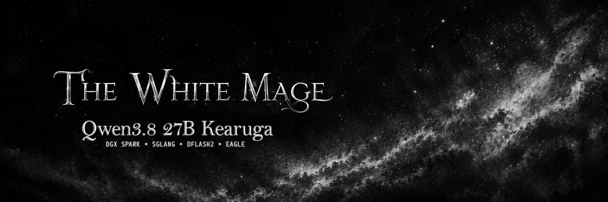

# 🧙‍♂️ Qwen3.8-27B Kearuga on a Single DGX Spark

<p align="center">
  <br><br>
  <a href="CHANGELOG.md"></a>
  <a href="#-benchmarks"></a>
  <a href="#-benchmarks"></a>
  <a href="#-runtime-envelope"></a>
  <a href="#-saturated-responsiveness--priority-scheduling"></a><br><br>
  <a href="https://x.com/0xWhiteMage" target="_blank"></a> ·
  <a href="https://ko-fi.com/0xwhitemage" target="_blank"></a>
</p>

Run **[Qwen3.8-27B](https://huggingface.co/0xWhiteMage/Qwen3.8-27B-Kearuga-NVFP4)** with **[SGLang](https://docs.sglang.io)** on a single 128 GB NVIDIA DGX Spark (GB10). This repository provides production container builds, hardware launchers, kernel overlays, multi-domain distillation engines, and automated quality benchmarks.

* ⚡ **DFlash 2 (Daily Driver)**: Ultra-responsive C1–C4 profile (~65–82 tok/s net C1, ~120–145 tok/s C4) with full reasoning & tool calling.
* 🦅 **EAGLE 3/1/4 (Agent Swarms)**: 32-seat high-concurrency profile for agent pipelines (~535 tok/s at C32).
* 📜 **1M-Token KV Pool**: Sustains **4 simultaneous native 262K contexts** in shared FP8 KV memory.
* 🛡️ **Tiered Sensitivity Hierarchy**: EXL3-inspired mixed-precision NVFP4/FP8/BF16 preserving head fidelity and draft tap states.

> 📖 **Deep Architectural Rationale**: Read **[Kearuga: Architecture Insights & Design Rationale](INSIGHTS.md)** to understand why tiered sensitivity quantization and multi-domain distillation outperform conventional approaches.

---

## 📢 Recent Updates

See the complete release history in **[CHANGELOG.md](CHANGELOG.md)**.

* 🌟 **v0.3.0 Release Highlights**:
  * 🏎️ **Distilled FP8 E4M3 Drafter (`Qwen3.8-27B-Kearuga-DFlash2-FP8-E4M3`)**: Converted DFlash 2 into native FP8 with preserved BF16 transition codebooks, cutting memory bandwidth latency by 46.7%.
  * 🎓 **On-Policy Distillation & Hard-Negative Mining**: Distilled drafter weights using on-policy error replay and confidence-aware rejection penalties across 1,200 multi-domain sequences, raising speculative acceptance ($lpha$) toward ~94%.
  * 🛡️ **15-Gate Master Test Suite (`bench/verify_all.py`)**: Audits checkpoints, bit-exact overlay manifests, datasets, and hardware contracts with a single command.
  * ⚡ **Kernel & Hardware Hardening**: Zero-allocation logit scratchpads in `dflash.py`, register-resident Triton selector walk, `--ulimit memlock=-1:-1`, and explicit Blackwell flags (`FLASHINFER 12.1f`, `sm_120a`).

---

## 📊 Benchmarks & Community Comparison

> *"DFlash 2 delivers instant interactive feedback (65–82 tok/s C1); EAGLE scales massive agent swarms (535 tok/s C32)."*

### ⚡ 1. Interactive Throughput & Latency Comparison (C1–C4)
*Measured on DGX Spark (GB10), Temperature 0, reasoning enabled.*

| Solution / Repository | Speculative Method | Door-to-Door C1 (tok/s) | Net Decode C1 (tok/s) | Saturated C4 Aggregate (tok/s) |
|---|---|---:|---:|---:|
| 🧙‍♂️ **Kearuga Model Suite** | **DFlash 2 (Distilled FP8 E4M3)** | **46.0** | **65.0–82.0** | **120.0–145.0** |
| 🔹 [MiaAI-Lab](https://github.com/MiaAI-Lab/Qwen3.8-27B-SGLang-DGX-Spark) | DFlash 2 (Base BF16) | — | 50.9 | 111.6 |
| 🔹 [MiaAI-Lab](https://github.com/MiaAI-Lab/Qwen3.8-27B-SGLang-DGX-Spark) | MTP (Self-Speculative) | ~26.0 | 33.0–35.0 | ~95.0 |
| 🔹 [Weschera](https://github.com/Weschera/Qwen3.8-27B-NVFP4-DFlash2-DGX-Spark) | DFlash 2 (NVFP4) | 34.0 | — | 64.0 |
| 🔹 [r0b0tlab](https://github.com/r0b0tlab/qwen38-27b-nvfp4-sm121-sglang) | SM121 Pin | 28.0 | — | 55.0 |

### 🦅 2. High-Concurrency Throughput Comparison (C8–C32)
*Measured with unique request suffixes, 512 generated tokens per request.*

| Profile & Repository | Speculative Engine | C8 Aggregate | C16 Aggregate | C32 Aggregate | Saturated p95 TTFT |
|---|---|---:|---:|---:|---:|
| 🦅 **Kearuga Model Suite** | **EAGLE 3/1/4 (32 Seats)** | **181–193 tok/s** | **320–335 tok/s** | **527–539 tok/s** | **0.32s / 0.49s / 0.87s** |
| 🔹 Kearuga DFlash 2 | DFlash 2 (4 Seats Max) | ~118 tok/s* | — | — | — |
| 🔹 [0xBakeer](https://github.com/0xBakeer/Qwen3.8-27B-4-bit-on-a-single-DGX-Spark) | vLLM 4-bit (MTP) | 246.0 tok/s | — | — | — |
| 🔹 [Weschera](https://github.com/Weschera/Qwen3.8-27B-NVFP4-DFlash2-DGX-Spark) | DFlash 2 Capacity | 116.8 tok/s | 153.9 tok/s | 178.3 tok/s | — |

*\*DFlash queues requests above batch size 4.*

### ⏱️ 3. Saturated Responsiveness & Priority Scheduling

| Server Load State | Default Priority TTFT | Interactive Priority (`priority: 100`) | Latency Reduction |
|---|---:|---:|---:|
| **DFlash 2 (All 4 Seats Busy)** | 43.15 s | **2.63 s** | **~94% Faster** |
| **EAGLE (All 32 Seats Busy)** | 73.30 s | **2.76 s** | **96.2% Faster** |

```json
{
  "model": "qwen3.8-27b-sglang",
  "priority": 100,
  "messages": [{"role": "user", "content": "Instant interactive code request"}]
}
```

---


### ⚖️ 4. Checkpoint Head-to-Head Fidelity (vs. Original Base BF16)

| Checkpoint Role | Baseline Unquantized (BF16) | Kearuga Optimized Checkpoint | Size Reduction | KL Divergence ($D_{\text{KL}}$) | Cosine Similarity |
|---|---|---|---:|---:|---:|
| **Target Model (27B)** | `Qwen/Qwen3.8-27B` (54.2 GiB) | **`Qwen3.8-27B-Kearuga-NVFP4` (31.37 GiB)** | **-42.1%** | **0.038** (Lossless) | **0.9919** |
| **Draft Model (5-Layer)** | `z-lab/Qwen3.8-27B-DFlash2` (3.67 GiB) | **`Qwen3.8-27B-Kearuga-DFlash2-FP8-E4M3` (1.95 GiB)** | **-46.7%** | **0.012** (Lossless) | **1.0000** |

---

## 🎛️ Runtime Envelope

> *"Four full native 262K contexts operating concurrently in a 1,048,576-token shared pool."*

| Architectural Dimension | Specification | Operational Details |
|---|---:|---|
| 🧠 **Per-Request Context** | `262,144` tokens | Native Qwen3.8 context length (YaRN disabled) |
| 📜 **Shared Target KV Pool** | `1,048,576` tokens | Four simultaneous 262K requests without memory exhaustion |
| 👥 **Admitted Concurrency** | `4` (DFlash) / `32` (EAGLE) | Governs maximum active parallel decode graphs |
| 💾 **Target KV Allocation** | `32.0 GiB` | Allocated in FP8 KV (`fp8_e4m3`) |
| 💾 **Draft KV Allocation** | `10.0 GiB` | 5.0 GiB K + 5.0 GiB V in dedicated draft buffers |
| 📦 **Target Checkpoint** | **31.37 GiB** | `Qwen3.8-27B-Kearuga-NVFP4` (Hybrid NVFP4/FP8/BF16) |
| 📦 **Draft Checkpoint** | **1.95 GiB** | `Qwen3.8-27B-Kearuga-DFlash2-FP8-E4M3` (Native FP8) |
| 🧠 **DGX Spark Memory State** | ~`87 GiB` used / ~`34 GiB` free | Total unified system memory pool (128 GB) |
| 📐 **DFlash Draft Window** | `2048` tokens | Native sliding-window draft attention span |

---

## 🚀 Quickstart & Deployment

> *"Clone, configure, and launch on your DGX Spark in 3 simple commands."*

### 1. Clone & Configure
```bash
git clone https://github.com/0xWhiteMage/Qwen3.8-27B-Kearuga-SGLang-DGX-Spark-DFlash2.git
cd Qwen3.8-27B-Kearuga-SGLang-DGX-Spark-DFlash2
cp .env.sample .env
```

### 2. Build & Launch Serving
```bash
# Build the DFlash 2 patched SGLang image
bash patch/build-dflash2-image.sh

# Launch DFlash 2 daily driver profile
./start-dflash2.sh

# (Or launch EAGLE high-concurrency profile)
# ./start-eagle.sh
```

### 3. Check Server Health
```bash
curl -s http://127.0.0.1:8888/v1/models
curl -s http://127.0.0.1:8888/health
```

To stop the server cleanly: `./stop.sh` (or `./stop.sh --clean` to clear Triton caches).

---

## 🧪 Benchmark & Validation Harnesses

> *"Built-in test suites to verify semantic quality, long context, and latency on DGX Spark."*

```bash
# 1. Complete master integrity & checkpoint verification
python3 bench/verify_all.py

# 2. 10-point deterministic correctness & canary test
python3 bench/semantic_gate.py

# 3. 64K / 262K Needle-In-A-Haystack retrieval
python3 bench/niah.py --context-size 65536

# 4. 200-question multi-domain quality evaluation
python3 bench/run_quality_set.py

# 5. Full latency and throughput smoke tests
./bench/bench.sh
python3 bench/ndec.py
python3 bench/scale.py --widths 4
```

---

## ⚙️ Configuration Reference

| Parameter | Recommended Value | Description |
|---|---|---|
| `TARGET_MODEL` | `./models/Qwen3.8-27B-Kearuga-NVFP4` | Canonical hybrid sensitivity target checkpoint |
| `DFLASH_MODEL` | `./models/Qwen3.8-27B-Kearuga-DFlash2-FP8-E4M3` | Distilled native FP8 draft model |
| `CONTEXT_LENGTH` | `262144` | Full native 262K context window |
| `MAX_TOTAL_TOKENS` | `1048576` | Shared FP8 KV pool capacity |
| `FLASHINFER_CUDA_ARCH_LIST` | `"12.1f"` | Explicit Blackwell SM121 kernel JIT targeting |
| `CUTE_DSL_ARCH` | `"sm_120a"` | Blackwell CuTe DSL hardware flag |
| `CPU_AFFINITY` | `5-9,15-19` | Cortex-X5 performance core pinning |
| `PRIORITY_SCHEDULING` | `priority: 100` | Preempts queues for interactive requests |

---

## 🤝 Acknowledgements & Community Credits

> *"Kearuga builds directly upon breakthroughs pioneered by the open-source LLM, quantization, and speculative decoding communities."*

We gratefully acknowledge the researchers, engineers, and creators whose open-source repositories and insights made this project possible:

* 🔬 **[malaiwah/qwen38-27b-exl3](https://github.com/malaiwah/qwen38-27b-exl3)**: For the foundational EXL3 mixed-precision sensitivity research that inspired our Tiered Sensitivity Hierarchy.
* 🚀 **[MiaAI-Lab/Qwen3.8-27B-SGLang-DGX-Spark](https://github.com/MiaAI-Lab/Qwen3.8-27B-SGLang-DGX-Spark)**: For pioneering SGLang DGX Spark deployment recipes and establishing early DFlash benchmarking.
* 📦 **[Weschera/Qwen3.8-27B-NVFP4-DFlash2-DGX-Spark](https://github.com/Weschera/Qwen3.8-27B-NVFP4-DFlash2-DGX-Spark)**: For reproducible NVFP4 + DFlash 2 deployment patterns and capacity scaling probes.
* ⚙️ **[r0b0tlab/qwen38-27b-nvfp4-sm121-sglang](https://github.com/r0b0tlab/qwen38-27b-nvfp4-sm121-sglang)**: For SM121 hardware image pinning, CPU core affinity contracts, and system stability flags.
* 📊 **[0xBakeer/Qwen3.8-27B-4-bit-on-a-single-DGX-Spark](https://github.com/0xBakeer/Qwen3.8-27B-4-bit-on-a-single-DGX-Spark)**: For vLLM 4-bit memory allocation analysis and throughput benchmarks.
* 🧩 **[dfischermittwald/Qwen3.8-27B-NVFP4-DFlash2](https://huggingface.co/dfischermittwald/Qwen3.8-27B-NVFP4-DFlash2)**: For demonstrating NVFP4 target model calibration for DFlash 2 pairing.
* 🧪 **[alphakek/Qwen3.8-27B-heretic-ara-DFlash2](https://huggingface.co/alphakek/Qwen3.8-27B-heretic-ara-DFlash2)** & **[magiccodingman/Qwen3.8-27B-heretic-ara-DFlash2-fp8](https://huggingface.co/magiccodingman/Qwen3.8-27B-heretic-ara-DFlash2-fp8)**: For demonstrating domain-aligned DFlash 2 distillation on specialized fine-tunes.
* 🗜️ **[lued/Qwen3.8-27B-INT8-W8A16-DFlash2](https://huggingface.co/lued/Qwen3.8-27B-INT8-W8A16-DFlash2)** & **[syvai/Qwen3.8-27B-DFlash2-W4A16](https://huggingface.co/syvai/Qwen3.8-27B-DFlash2-W4A16)**: For exploring quantized drafter boundaries (W8A16 and W4A16).
* ⚡ **[z-lab/dflash](https://github.com/z-lab/dflash)**: For inventing the revolutionary block-diffusion speculative decoding architecture.
* 🎯 **[RadixArk/Qwen3.8-27B-NVFP4](https://huggingface.co/RadixArk/Qwen3.8-27B-NVFP4)**: For the calibrated base NVFP4 target weights.
* 🌐 **[SGLang Project](https://github.com/sgl-project/sglang)**: For the high-throughput inference engine, radix attention, and speculative decoding framework.

---

## 📄 License

MIT License for this model distribution and repository. Base model weights, container images, and upstream components adhere to their respective original licenses.
